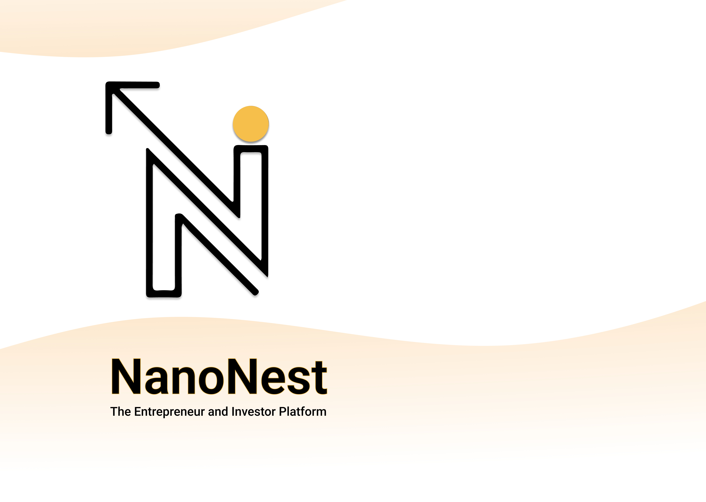
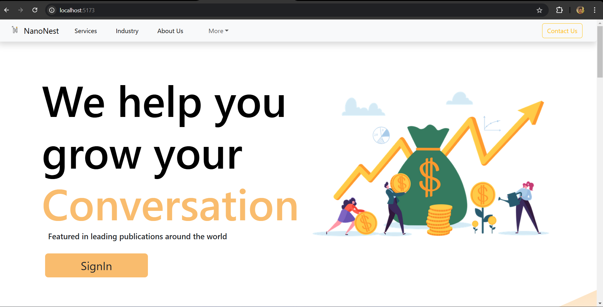

# NanoNest


**NanoNest** is an innovative platform designed to connect micro and nano entrepreneurs with potential investors and collaborators. It serves as a crowdfunding and networking platform, empowering small businesses to showcase their projects, raise funds, and interact with like-minded individuals.

## Features

### 1. **Entrepreneur Profiles**
- Entrepreneurs can create profiles, showcase their business ideas, and upload details about their startups.
- Potential investors can explore profiles and invest in promising ideas.

### 2. **Investor Dashboard**
- Investors can browse through a curated list of startups.
- Features include viewing entrepreneur details, business goals, and funding needs.

### 3. **Posts and Updates**
- Entrepreneurs can post updates about their business, including milestones and progress.
- Posts include features like "like," "share," and "comment."

### 4. **Real-Time Chat**
- Investors and entrepreneurs can communicate through a live chat system.
- Powered by Firebase for real-time messaging.

### 5. **Responsive Design**
- The platform is fully responsive and optimized for both desktop and mobile devices.

### 6. **Admin Controls**
- Admins can manage users, monitor activity, and ensure compliance.

---

## Tech Stack

**Frontend:**
- React.js (JavaScript)
- Material-UI for styling and components
- Swiper.js for carousels and sliders

**Backend:**
- Firebase Realtime Database for data storage and retrieval
- Firebase Authentication for user management

**Hosting:**
- Firebase Hosting

---

## Installation

1. Clone the repository:
   ```bash
   git clone https://github.com/your-username/NanoNest.git
   ```

2. Navigate to the project directory:
   ```bash
   cd NanoNest
   ```

3. Install dependencies:
   ```bash
   npm install
   ```

4. Create a `.env` file in the root directory and add your Firebase configuration:
   ```env
   REACT_APP_FIREBASE_API_KEY=your_api_key
   REACT_APP_FIREBASE_AUTH_DOMAIN=your_auth_domain
   REACT_APP_FIREBASE_DATABASE_URL=your_database_url
   REACT_APP_FIREBASE_PROJECT_ID=your_project_id
   REACT_APP_FIREBASE_STORAGE_BUCKET=your_storage_bucket
   REACT_APP_FIREBASE_MESSAGING_SENDER_ID=your_messaging_sender_id
   REACT_APP_FIREBASE_APP_ID=your_app_id
   ```

5. Start the development server:
   ```bash
   npm start
   ```

6. Visit the platform at `http://localhost:3000`.

---

## Usage

1. **Entrepreneurs**:
   - Sign up, create a profile, and upload your business details.
   - Post updates to keep investors informed about your progress.

2. **Investors**:
   - Browse entrepreneur profiles, view their goals, and choose startups to invest in.

3. **Messaging**:
   - Use the built-in chat feature to communicate directly with entrepreneurs or investors.

---

## Folder Structure

```
NanoNest/
├── public/
├── src/
   ├── components/      # Reusable components
   ├── pages/           # Page components
   ├── utils/           # Utility functions
   ├── Firebase.js      # Firebase configuration
   └── App.js          # Main application
```

---

## Screenshots

### Home Page:


### Entrepreneur Profile:


### Investor Dashboard:


---


---

## Contact

For any inquiries or feedback, please reach out to:
- Email: mrhemant619@gmail.com
- GitHub: [@HemantBhujang](https://github.com/hemantbhujang)
- GitHub: [@sakshi123kakde](https://github.com/sakshi123kakde)


